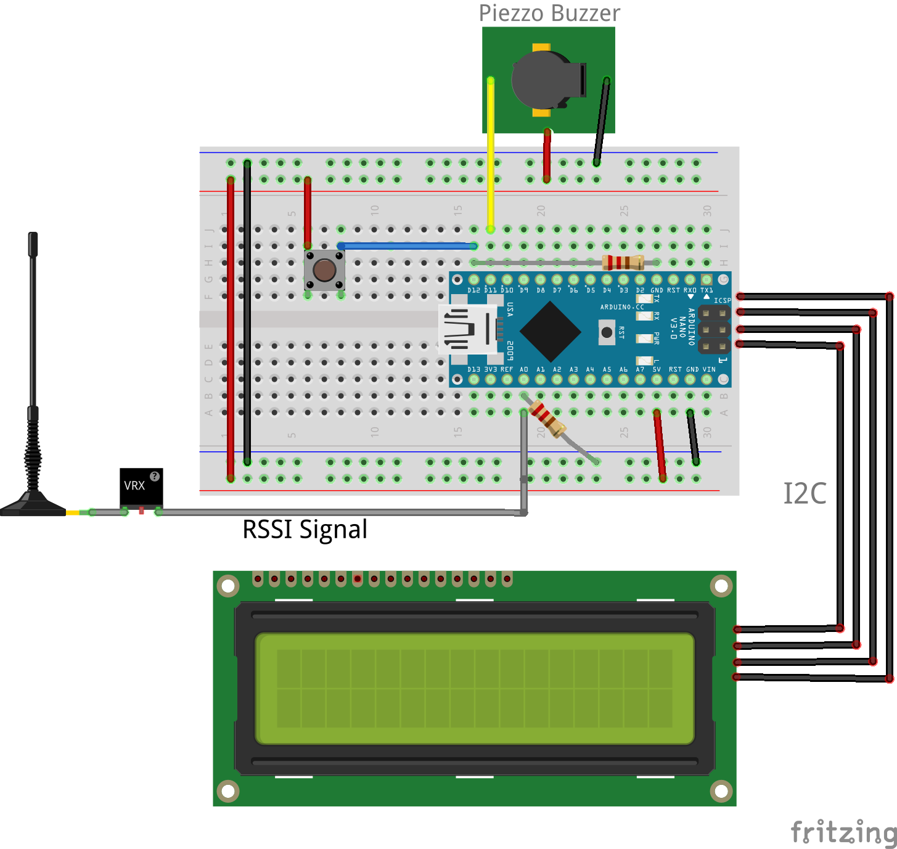

# A Simple Arduino RSSI Meter

This is a very simple RSSI Meter made with Arduino.
I chose the I2C version of LCD because it needs only 4 connections in VCC, GND, A4 and A5.

* Pin D12: Config Button
* Pin D8: Piezzo Buzzer Signal
* Pin A0: RSSI from Video RX

There's no need to connect the ground from your VRX in your Arduino, but it's important to use a pulldown resistor with the RSSI input in A0 and also with your D12 pushbutton.
Please, see the schema below.

<h3>Configuring</h3>

With the config button, there's no need anymore to look for the voltages in RSSI and change in the source code. You can find these values with your RSSI Meter and it will keep it saved

Press the button in D12 for 1 second to enter in configuration mode.
- Step 1 - Set the minimum value. It's when your is VRX is On and your VTX is Off. RSSI Meter will show a value comming from your VRX meaning your 0% signal. Press buton to save.
- Step 2 - Set the maximum value. Now your VRX and your VTX should be turned On and close to each other. Again a value is shown in LCD and this is your 100% RSSI signal. Press button again.

The values are saved in EEPROM. You will need to enter in config again only if you replace your VRX or start using another type of antenna, because these values may be a little different for these changes.

Please, feel free to suggest any improvements.

denys.sene@gmail.com

